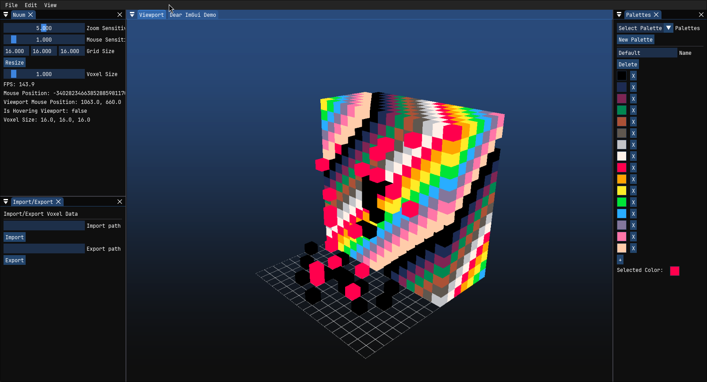

# NuumVoxel

**Nuum** is a fast, modern voxel model editor powered by real-time GPU raytracing. Inspired by tools like MagicaVoxel, Nuum is designed for creativity and responsiveness — minimal interface, instant feedback, and a focus on fluid voxel sculpting.



---

## Features

- **Intuitive camera navigation** and UI built with ImGui
- **Real-time GPU raytracing** with a 3D texture voxel backend
- Built using **bgfx**, **SDL2**, and **Dear ImGui**

## Planded Features

- [ ] **Voxel editing** with brush tools, palette, and undo/redo
- [ ] **Material/color palette system**
- [ ] **Custom voxel file format**, with export options planned

---

## Controls

| Action       | Key / Mouse        |
| ------------ | ------------------ |
| Orbit camera | Right mouse        |
| Pan camera   | Shift + Right mouse|
| Zoom         | Scroll wheel       |
| Add voxel    | Left click         |
| Remove voxel | Shift + Left click |
| Color select | Palette UI         |

## Building

### Prerequisites

- C++20 or later
- CMake 3.5
- SDL2
- Freetype

### Build Instructions

```bash
git clone https://github.com/TXTstyle/nuum.git
cd nuum
cmake -S . -B build
cmake --build build
```

## Acknowledgments

- [bgfx](https://github.com/bkaradzic/bgfx)
- [Dear ImGui](https://github.com/ocornut/imgui)
- [SDL2](https://www.libsdl.org/)
- Inspired by [MagicaVoxel](https://ephtracy.github.io/)
